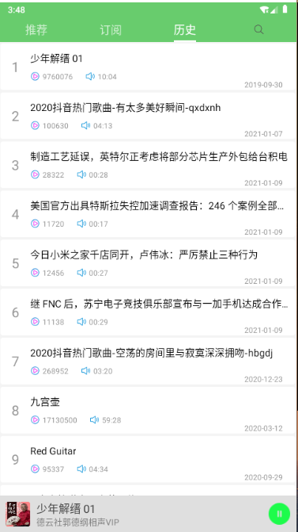

项目简述： 接入喜马拉雅FM SDK 资源，资源齐全，听书 ， 听歌 ， 广播 ， 等等资源都有，功能齐全。

项目架构 ： MVP + okhttp + Rxjava + MagicIndicator导航（第三方库） + tkrefreshlayout上拉下拉刷新（第三方库）。

高斯模糊毛玻璃效果工具类，自定义View，SQLite数据库等等。注释详细

项目运行截图：

主页：-        播放页面：-    历史：- 

订阅：-        搜索：-    搜索结果：- 

顺序切换：-   
